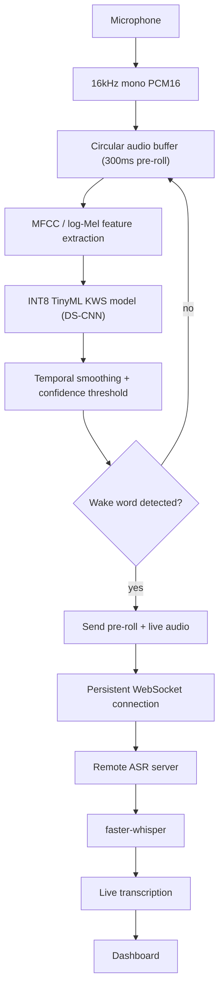

# tinywake

A hybrid **TinyML Keyword Spotting + Cloud ASR** system. A custom wake
word ("**Hey Nova**") is detected fully on-device with an INT8
DS-CNN; only after a confirmed detection does any audio leave the
device, streamed over a persistent WebSocket to a server running
`faster-whisper` for transcription.

Fully open-source. No proprietary wake-word SDKs, no pretrained
assistant keywords (Alexa/Hey Google/Siri), no paid cloud services.

## Project goals (in priority order)

1. **Tiny memory footprint** — target < 256 KB RAM, INT8 model < 100 KB
2. **Near-zero false activations** — measured as False Activations Per Hour (FAPH)
3. **Minimum wake-to-server latency**
4. **Privacy** — no audio transmission before wake detection, ever

## Architecture



Everything left of the WebSocket boundary is what eventually ports to
an ESP32-S3 (see `docs/esp32_mapping.md`); everything right of it
stays server-side.

## Repository layout

```
tinywake/
├── config.py                # single source of truth for all tunables
├── logging_utils.py         # shared [TAG] structured logging
├── dataset/                 # your recorded WAVs (gitignored)
├── training/                 # data pipeline, model, training, quantization
├── models/                   # trained/quantized model artifacts (gitignored)
├── edge_simulator/            # laptop stand-in for the future ESP32 firmware
├── server/                   # FastAPI WebSocket + ASR server
├── dashboard/                 # single-file HTML monitoring dashboard
├── benchmarks/                 # latency, FAPH, accuracy, bandwidth tests
└── docs/                      # ESP32 porting notes, memory budget
```

## Installation

```bash
python -m venv .venv
source .venv/bin/activate        # Windows: .venv\Scripts\activate
pip install -r requirements.txt
```

`sounddevice` requires PortAudio; on most systems `pip install
sounddevice` pulls in a working wheel. On Linux you may additionally
need `sudo apt install libportaudio2`.

## 1. Dataset creation

Record at least ~40 "Hey Nova" samples and a comparable number of
`unknown` (other speech) and `noise` (silence/background) samples,
ideally from **multiple speakers** — the train/val/test split is done
per-speaker, so a single-speaker dataset will fall back to
train-only (see the warning `preprocess.py` prints in that case).

```bash
python training/collect_audio.py --label hey_nova --speaker jay --samples 40
python training/collect_audio.py --label unknown --speaker jay --samples 40
python training/collect_audio.py --label hard_negative --speaker jay --samples 20
python training/collect_audio.py --label noise --speaker room1 --samples 20
```

Then build the speaker-disjoint train/val/test manifest:

```bash
python training/preprocess.py
```

## 2. Training

```bash
python training/train.py
```

Saves `models/kws_fp32.keras` and `models/training_metrics.json`.

## 3. Evaluation

```bash
python training/evaluate.py
```

Reports accuracy/precision/recall/confusion matrix and a
confidence-threshold sweep with a recommended `WAKE_THRESHOLD`.

## 4. Quantization

```bash
python training/quantize.py
```

Produces `models/kws_int8.tflite` (fully INT8: weights, activations,
input, output — TFLite Micro compatible) and prints the FP32 vs INT8
size/accuracy comparison.

## 5. Running the laptop KWS pipeline

**Stage 1 — just the wake word:**

```bash
python training/live_test.py --model models/kws_int8.tflite
```

Say "Hey Nova" and confirm you see a `<-- WAKE!` marker in the
terminal.

**Stage 2 — full pipeline (KWS + streaming + ASR):**

Terminal 1:
```bash
python server/server.py
```

Terminal 2:
```bash
python edge_simulator/main.py
```

Say "Hey Nova", then ask a question. You should see:

```
[WAKE] Hey Nova detected
[STREAM] session=... started
[NETWORK] first packet sent
...
```

and on the server terminal:

```
[SERVER] first packet received
[ASR] What is the capital of France?
```

After ~800ms of silence, the stream ends and the system returns to
`LISTENING`.

## 6. Dashboard

Open `dashboard/index.html` directly in a browser while
`server/server.py` is running (it connects to
`ws://localhost:8000/dashboard`). It shows system state, wake
confidence, live transcription, latency, bandwidth, and false
activations.

## 7. Benchmarking

```bash
python benchmarks/false_activation_test.py --dir dataset/noise
python benchmarks/accuracy_test.py
python benchmarks/bandwidth_test.py --seconds 10
python benchmarks/latency_test.py --live 10   # requires server.py running
```

## ESP32-S3 deployment roadmap

1. Validate accuracy/FAPH targets on the laptop simulator first.
2. Export the model: `python training/export_esp32.py` -> `esp32_export/model_data.cc/.h`
3. Port `microphone.py` -> I2S, `features.py` -> embedded MFCC,
   `kws_engine.py` -> TFLite Micro, `ring_buffer.py` -> static circular
   buffer, `streaming.py` -> ESP-IDF WebSocket client, `vad.py` ->
   embedded VAD. Full mapping: `docs/esp32_mapping.md`.
4. Validate against `docs/memory_budget.md` targets on real hardware.

## Known limitations

- The MFCC implementation uses `tf.signal` (float32) as the reference;
  an embedded fixed-point MFCC will need explicit accuracy validation
  against it before trusting on-device results.
- `augmentation.py`'s time-stretch/pitch-shift are resample-based
  approximations, not phase-vocoder quality — fine for training
  diversity, not for audio production use.
- The WebSocket connection is unauthenticated and unencrypted
  (`ws://`, not `wss://`) — this is a research/demo project; add TLS
  and auth before deploying anywhere untrusted.
- Only PCM16 streaming is implemented; ADPCM/Opus are architected for
  (see `streaming.py` and `bandwidth_test.py`) but not yet built.
- `training/preprocess.py`'s resampler is a simple linear
  interpolation, not a high-quality polyphase resampler — fine as
  long as you record at 16kHz directly (recommended).
